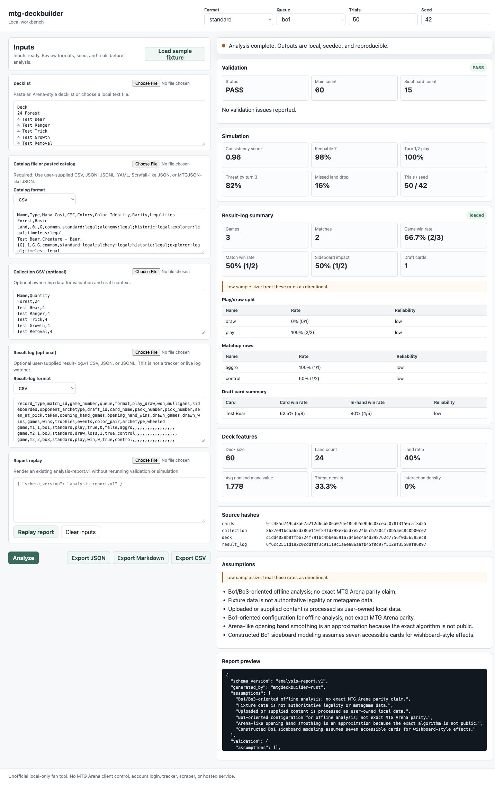
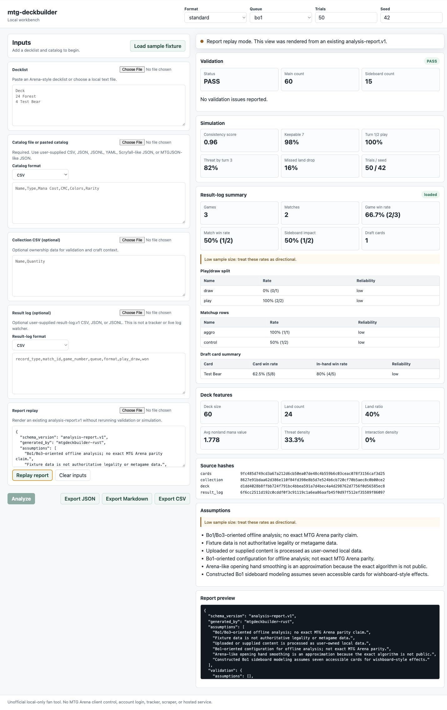
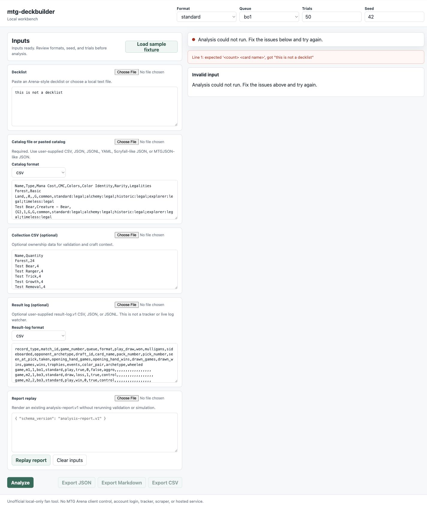
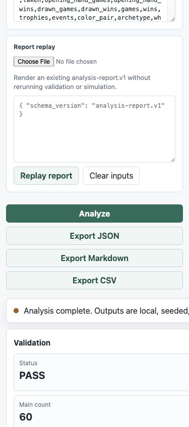

# mtg-deckbuilder

## What This Is

`mtg-deckbuilder` is a Rust-first, offline Magic deck analysis engine with Arena-style import/export conventions, validation, ingestion, simulation, statistics, and reporting. It works from user-supplied card catalogs, decklists, collection files, and result records.

It is not an MTG Arena client, overlay, tracker, bot, or exact gameplay simulator.

## Why It Exists

Most MTG deck tools sell convenience around overlays, collection sync, pricing, draft helpers, metagame dashboards, or personal history. This project is aimed at a different layer: a deterministic, auditable Rust engine that can validate inputs, run seeded Bo1/Bo3-oriented simulations, calculate transparent metrics, and export structured artifacts for future dashboards, APIs, and LLM-assisted analysis.

## Current Capabilities

- Arena-style decklist parsing and export.
- Collection CSV parsing with conservative ownership detection.
- Local card catalog loading from Scryfall-like JSON, MTGJSON-like JSON, generic CSV, generic JSON, JSONL, and YAML.
- Local `result-log.v1` loading from user-supplied CSV, JSON, and JSONL match/draft records.
- Format-aware validation hooks for copy limits, sideboards, ownership, wildcards, bans, legalities, and Arena-style deck-format checks from supplied catalog data.
- Seeded opening-hand and first-three-turn simulation proxies.
- Bo1/Bo3-oriented simulation configs with explicit assumptions.
- Constructed and draft metric primitives, including Wilson confidence intervals and sample-size warnings.
- JSON, Markdown, and CSV report rendering.
- `llm_report.v1` structured artifact generation.
- Backend-ready API contract structs and route constants.
- Local-only Axum web workbench for browser-based deck/catalog/result-log analysis, report replay, and exports.

## Architecture

```text
src/
  main.rs              thin CLI entrypoint
  cli/                 command routing and output
  domain/              public domain structs
  catalog/             CSV/JSON/JSONL/YAML catalog ingestion and schemas
  ingest/              source-specific deck, collection, Scryfall, MTGJSON loaders
  result_log/          user-owned local match and draft result-log ingestion
  rules/               validation rules
  features/            deck feature extraction
  sim/                 seeded simulation primitives plus bo1/bo3 configs
  stats/               constructed and draft metric primitives
  report/              JSON, Markdown, CSV report rendering
  llm/                 structured LLM-ready artifacts only
  api_contract/        future web/API request and response structs
  web.rs               local-only Axum workbench and JSON API
  web_assets/          embedded HTML/CSS/JS workbench assets
```

## Data Formats

Supported catalog inputs:

- CSV: generic card rows and user-provided Arena-style CSV aliases such as `Quantity,Name,Set,Type,Mana Cost,CMC,Colors,Rarity`.
- JSON: Scryfall-like, MTGJSON-like, or `catalog.v1`.
- JSONL: one `catalog.v1` card record per line.
- YAML: `catalog.v1` document.

Examples live in `examples/sample_catalog.csv`, `examples/sample_catalog.json`, `examples/sample_catalog.jsonl`, and `examples/sample_catalog.yaml`.

Supported result-log inputs:

- CSV: typed rows with `record_type` set to `game` or `draft_pick`.
- JSON: `result-log.v1` document with `games` and `draft_picks`.
- JSONL: one typed `game` or `draft_pick` record per line.

Result logs are user-supplied local files only. They are not imported from live trackers, hosted APIs, MTG Arena clients, or external scrapers.

Optional future analytics storage: Arrow/Parquet. These are not dependencies in V1 because the current surface is a CLI/library foundation, not a large analytics warehouse.

## Quick Start

```bash
cargo build
cargo test --all-features
cargo run --bin mtgdeckbuilder -- --help
```

Validate the fixture deck:

```bash
cargo run --bin mtgdeckbuilder -- validate \
  --deck examples/sample_deck.txt \
  --cards tests/fixtures/cards_scryfall.json \
  --collection tests/fixtures/collection.csv \
  --format standard
```

## CLI Usage

```bash
cargo run --bin mtgdeckbuilder -- import-catalog \
  --input examples/sample_catalog.csv

cargo run --bin mtgdeckbuilder -- import-result-log \
  --input tests/fixtures/result_logs.csv

cargo run --bin mtgdeckbuilder -- simulate \
  --deck examples/sample_deck.txt \
  --cards tests/fixtures/cards_scryfall.json \
  --queue bo1 \
  --trials 500 \
  --seed 42

cargo run --bin mtgdeckbuilder -- report \
  --deck examples/sample_deck.txt \
  --cards tests/fixtures/cards_scryfall.json \
  --collection tests/fixtures/collection.csv \
  --format standard \
  --output markdown \
  --result-log tests/fixtures/result_logs.json

cargo run --bin mtgdeckbuilder -- schema --name catalog
cargo run --bin mtgdeckbuilder -- schema --name result-log

cargo run --bin mtgdeckbuilder -- llm-artifact \
  --deck examples/sample_deck.txt \
  --cards tests/fixtures/cards_scryfall.json \
  --format standard \
  --trials 100 \
  --seed 42
```

## Local Web Workbench

Run the local browser workbench:

```bash
cargo run --bin mtgdeckbuilder-web
```

Then open `http://127.0.0.1:8765/`.

The workbench processes pasted or uploaded text in memory through the Rust server:

- decklists
- user-supplied catalogs
- optional collection CSV
- optional structured `result-log.v1` CSV, JSON, or JSONL
- existing `analysis-report.v1` JSON for report replay

It does not control MTG Arena, watch logs, access a Steam or Wizards account, scrape clients, run overlays, or provide a hosted service.

### Workbench Preview

These screenshots are generated from local sample/dev fixtures. They do not bundle Wizards logos, card art, proprietary game data, private account data, or Steam/MTG Arena client state, and they do not show or interact with MTG Arena, Steam, Wizards accounts, logs, overlays, or client state.

<p>
  
</p>

<p>
  
  
</p>

<p>
  
</p>

## Simulation Model

The simulator is Bo1/Bo3-oriented, not exact MTG Arena parity.

- Bo1 uses an Arena-inspired opening-hand approximation based on explicit assumptions, not reverse-engineered client behavior, and a 7-card accessible sideboard assumption.
- Bo3 uses paper-random opening sampling and a 15-card sideboard assumption.
- Both modes use seeded `rand_chacha::ChaCha20Rng` reproducibility.
- Current outputs are opening-hand and early-turn quality proxies, not gameplay resolution or match win-rate truth.

## Constructed Metrics

The stats module supports:

- overall game win rate
- match win rate
- Bo1 performance
- Bo3 game performance
- sideboard impact
- mulligan sensitivity
- play/draw performance from user-supplied result logs
- opening-hand quality proxy via simulation reports
- matchup matrix
- Wilson confidence intervals
- sample-size warnings
- seeded reproducibility fields

## Draft Metrics

The draft metric primitives support:

- card win rate
- game-in-hand win rate
- opening-hand win rate
- improvement-when-drawn style delta
- average last seen at and average taken at equivalents
- pick order score
- color-pair and archetype fields
- trophy rate
- wheel rate / signal proxy
- pack and pick context
- sample-size reliability flags

## LLM Integration

LLM support is deliberately outside the deterministic core. The CLI can emit `llm_report.v1`, a structured JSON artifact containing validation, metrics, assumptions, source hashes, limitations, and prompt guidance. LLMs may explain or summarize that evidence, but they must not change validation, simulation, or metric outcomes.

## Web/API Readiness

The repo includes a local-only Axum workbench plus backend-ready structs and route constants for future hosted adapters.

Implemented local routes:

- `GET /`
- `GET /api/health`
- `POST /api/analyze`
- `POST /api/report/render`

The route constants still describe future durable API contracts for:

- `POST /deck/validate`
- `POST /simulation/run`
- `GET /simulation/{id}/status`
- `GET /simulation/{id}/results`
- `GET /simulation/{id}/report`
- `POST /export`

This repo does not currently ship a hosted API, account system, shared report store, or paid dashboard. Future adapters may be deployed with third-party hosting/build tools, but this repo does not ship a Vercel or Lovable.dev integration, endorsement, hosted service, payment flow, or account sync.

## Hosted / Lovable Conversion Path

The current app is a local Rust/Axum workbench. It is not yet a Vercel-hosted app, Lovable project, or account-backed dashboard.

A future hosted product should keep the Rust engine as the source of truth and treat browser-builder work as a UX/product layer around explicit user-owned data. Current platform docs support a conservative path:

- [Vercel deployments](https://vercel.com/docs/deployments) can be created from Git, Vercel CLI, deploy hooks, or the REST API.
- [Vercel Git deployments](https://vercel.com/docs/git) can produce preview deployments from branch pushes and production deployments from the configured production branch.
- [Lovable GitHub integration](https://docs.lovable.dev/integrations/github) supports syncing a Lovable project with GitHub for backup, collaboration, local editing, and deployment elsewhere.
- [Lovable deployment and ownership docs](https://docs.lovable.dev/tips-tricks/deployment-hosting-ownership) describe Lovable apps as portable Vite/React projects that can be hosted on managed platforms including Vercel.

Practical conversion options:

- Keep this repo canonical and extract the static workbench into a Vite/React front end that calls a Rust service adapter.
- Use Lovable as a prototype surface for hosted dashboard workflows, then port only reviewed UI/product ideas back into this repo.
- Use Vercel preview deployments for hosted experiments after adding a web build target and privacy-safe API adapter.
- Defer accounts, shared report storage, paid dashboards, report sharing, and payment flows until privacy, Wizards policy, trademark, data-retention, and monetization reviews are complete.

The hosted path must preserve the current exclusions: no MTG Arena client automation, Steam automation, account login/sync, overlays, live log watching, scraping, protected APIs, reverse engineering, or gameplay automation.

## Monetization / Product Direction

Research notes in `RESEARCH_NOTES.md` compare public positioning from Untapped.gg, AetherHub, MTGGoldfish, Arena Tutor/Draftsim, and 8Pack. Users pay for overlays, personal history, collection-aware recommendations, ad-free or unlimited storage, draft suggestions, pricing data, community comparisons, and dashboards.

This repo can differentiate through:

- free open-source CLI and deterministic engine
- hosted compute for deterministic simulation jobs
- private storage for user-owned reports and presets
- collaboration workspaces for testing teams
- API access around original analysis outputs
- original draft and constructed analytics over user-supplied data
- report exports for content creators

Commercial layers must respect Wizards IP, fan content, trademark, and terms boundaries.

Potential commercial layers should charge for compute, storage, collaboration, API access, and original analytics over user-supplied data, not for access to Wizards-owned card images, logos, game assets, official-looking branding, Arena account data, client-derived protected data, or gated fan content.

## Verification

Expected validation commands:

```bash
cargo fmt --check
cargo clippy --all-targets --all-features -- -D warnings
cargo test --all-features
cargo build --release
git diff --check
```

Smoke-test the main CLI surfaces:

```bash
cargo run --bin mtgdeckbuilder -- validate --deck examples/sample_deck.txt --cards tests/fixtures/cards_scryfall.json --collection tests/fixtures/collection.csv --format standard
cargo run --bin mtgdeckbuilder -- import-catalog --input examples/sample_catalog.csv
cargo run --bin mtgdeckbuilder -- simulate --deck examples/sample_deck.txt --cards tests/fixtures/cards_scryfall.json --queue bo1 --trials 25 --seed 7
cargo run --bin mtgdeckbuilder -- export --deck examples/sample_deck.txt
cargo run --bin mtgdeckbuilder -- report --deck examples/sample_deck.txt --cards tests/fixtures/cards_scryfall.json --collection tests/fixtures/collection.csv --format standard --output markdown --trials 25 --seed 7
cargo run --bin mtgdeckbuilder -- schema --name catalog
cargo run --bin mtgdeckbuilder -- llm-artifact --deck examples/sample_deck.txt --cards tests/fixtures/cards_scryfall.json --format standard --trials 25 --seed 7
```

## Limitations

- Fixture card data is not authoritative.
- Current legality, bans, restrictions, oracle text, Arena availability, and metagame state must be supplied from current trusted data.
- The Arena-like Bo1 smoother is an approximation because exact MTG Arena behavior is not public.
- Current simulation does not resolve full games, full match play, hidden information, combat, stack choices, or player decisions.
- No gameplay automation, screen scraping, protected API access, or Arena client control is included.
- No proprietary competitor schemas or code are copied.

## Roadmap

- Expand matchup matrix and sideboard impact reports from user-owned result data.
- Add archetype clustering from transparent feature vectors.
- Add optional Arrow/Parquet export behind a deliberate analytics feature gate.
- Add hosted-job adapters around the existing `api_contract` structs.
- Extend the local workbench with saved local presets and richer comparison views.
- Design future hosted dashboard/report-sharing work separately, with privacy, terms, and monetization review before implementation.

## License / Disclaimer

This repository is licensed under the AGPL-3.0 license in `LICENSE`.

`mtg-deckbuilder` is unofficial Fan Content. It is not affiliated with, endorsed by, sponsored by, or approved by Wizards of the Coast, Hasbro, Magic: The Gathering, or MTG Arena. Portions of the materials referenced by users may be property of Wizards of the Coast LLC. Users are responsible for ensuring that their data sources and use comply with applicable law, Wizards policies, MTG Arena terms, and third-party terms.
